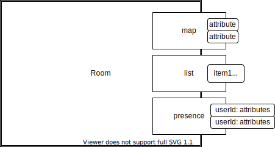

# Room Design

Authored: 2021-10-31

> Data structure design for open source roomservice.

- [Room Design](#room-design)
  - [Design Summary](#design-summary)
  - [Access Patterns](#access-patterns)
    - [Room](#room)
      - [Create](#create)
      - [Get](#get)
      - [Delete](#delete)
    - [Presence](#presence)
      - [Create](#create-1)
      - [Get](#get-1)
      - [Upsert](#upsert)
      - [RemoveItem](#removeitem)
      - [Delete](#delete-1)
    - [Map](#map)
      - [Create](#create-2)
      - [Get](#get-2)
      - [Upsert](#upsert-1)
      - [RemoveItem](#removeitem-1)
      - [Delete](#delete-2)
    - [List](#list)

## Design Summary

Rooms are the root level data structure. All other structures belong to the room.



- Room
  - Presence
    - Hash map of userID - value pairs belonging to the room
    - Changes made locally then sent over the wire
    - Expires on disconnect from the room
      - Evict specific entry from the room on disconnect
      - Evict specific entry from the room after specified time
  - Map
    - Hash map of key-value pairs belonging to the room
    - Changes made locally then sent over the wire
    - You can set values inside the map, **it will not deep merge**
  - List
    - Ordered list of items belonging to the room
    - Changes made locally then sent over the wire

## Access Patterns

List of known access patterns

- Create room
- Get room
- Delete room

- Create presence in room
- Get presence in room
- Add player to presence in room
- Remove player from presence in room
- Update player presence in room

- Add map to room
- Remove map from room
- Update map attribute in room

The primary key appears to be the room, everything needs to be accessed by that
attribute.

| Record Type | pk     | sk                      | Access pattern                          | MVP   |
| ----------- | ------ | ----------------------- | --------------------------------------- | ----- |
| Room        | roomId | ROOM                    | Create, Get, Delete                     | True  |
| Presence    | roomId | PRESENCE#<presenceName> | Create, Get, Upsert, RemoveItem, Delete | True  |
| Map         | roomId | MAP#<mapName>           | Create, Get, Upsert, Delete             | True  |
| List        | roomId | LIST#<listName>         | Create, Get, Upsert, Delete             | False |

### Room

No data is stored on the room, the room is simply a holding record for all other
data structures.

#### Create

Insert room into table, roomId is uuid, putItem

#### Get

Authenticated user looks up room using roomId in getItem

#### Delete

Deletes Room, Maps, Presence and Lists

### Presence

Presence data structure is attached to a room, there can be multiple presences in a single room.

Each piece of data in the presence is homogeneous (unlike maps!!).

```json
{
  "pk": "<roomId>",
  "sk": "PRESENCE#<presenceName>",
  "data": {
    "<userId1>": {
      "x": "",
      "y": ""
    },
    "<userId2>": {
      "x": "",
      "y": ""
    }
  }
}
```

#### Create

Insert presence into table, pk is uuid as roomId, sk is `PRESENCE#<presenceName>`

#### Get

Get presence from table, pk is uuid as roomId, sk is `PRESENCE#<presenceName>`

#### Upsert

Insert presence into table, pk is uuid as roomId, sk is `PRESENCE#<presenceName>`.

Data can only be inserted for the specific user. Server side, the userID being passed in must be validated (JWT?).

Usage, updateItem:

```ts
result = tbl.updateItem(
  Key={
    "pk": roomId,
    "sk": "PRESENCE#<presenceName>",
  },
  UpdateExpression="SET data.#userId = :userData",
  ExpressionAttributeNames={
    "#userId": userId
  },
  ExpressionAttributeValues={
    ":userData": userData
  },
  ReturnValues: "ALL_NEW"
)
```

The presence object mut be passed in full? For example, we need to always pass x, y, score when updating the map? Probably, we can make that required form the type when it passed into the function.

Users would be passing in a random map, so we would be setting all the values in every insert.

#### RemoveItem

Insert presence into table, pk is uuid as roomId, sk is `PRESENCE#<presenceName>`.

user should be removed on disconnect from the room.

```ts
result = tbl.updateItem(
  Key={
    "pk": roomId,
    "sk": "PRESENCE#<presenceName>",
  },
  UpdateExpression="REMOVE data.#userId",
  ExpressionAttributeNames={
    "#userId": userId
  },
  ReturnValues: "ALL_NEW"
)
```

#### Delete

Delete presence from table, pk is uuid as roomId, sk is `PRESENCE#<presenceName>`

### Map

The map is very similar to presence, but it can have heterogeneous values.

```json
{
  "pk": "<roomId>",
  "sk": "MAP#<mapName>",
  "data": {
    "<keyName1>": {
      "x": "",
      "y": ""
    },
    "<keyName2>": {
      "parts": "",
      "stock": ""
    }
  }
}
```

#### Create

Insert map into table, pk is uuid as roomId, sk is `MAP#<mapName>`

#### Get

Get map from table, pk is uuid as roomId, sk is `MAP#<mapName>`

#### Upsert

Insert amp into table, pk is uuid as roomId, sk is `MAP#<mapName>`.

Data can only be inserted for the specific user. Server side, the userID being passed in must be validated (JWT?).

Usage, updateItem:

```ts
result = tbl.updateItem(
  Key={
    "pk": roomId,
    "sk": "MAP#<mapName>",
  },
  UpdateExpression="SET data.#keyName1 = :dataValues",
  ExpressionAttributeNames={
    "#keyName1": keyName1
  },
  ExpressionAttributeValues={
    ":dataValues": dataValues
  },
  ReturnValues: "ALL_NEW"
)
```

#### RemoveItem

Insert into table, pk is uuid as roomId, sk is `MAP#<mapName>`.

Map has to explicitly have data removed, data should be persisted inside the room.

```ts
result = tbl.updateItem(
  Key={
    "pk": roomId,
    "sk": "MAP#<mapName>",
  },
  UpdateExpression="REMOVE data.#keyName1",
  ExpressionAttributeNames={
    "#keyName1": keyName1
  },
  ReturnValues: "ALL_NEW"
)
```

#### Delete

Delete map from table, pk is uuid as roomId, sk is `MAP#<mapName>`


### List

TODO
